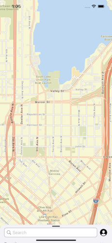
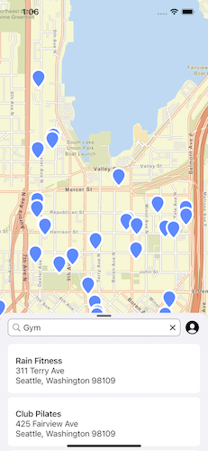
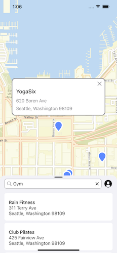
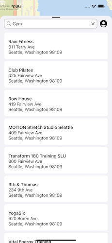

# AMLExamples

This project shows examples of how to create various layouts using the AmplifyMapLibreAdapter.

The first (and currently only) example shows a partial recreation of the iOS maps app.

Make sure to follow the [getting started guide](https://docs.amplify.aws/lib/geo/getting-started/q/platform/ios/) to configure your project to use Amplify Geo. 
Once you've done that, check out the example code in the [`ExampleOne`](AMLExamples/ExampleOne) directory of this project for ideas and inspiration. 

## ExampleOne

Images

